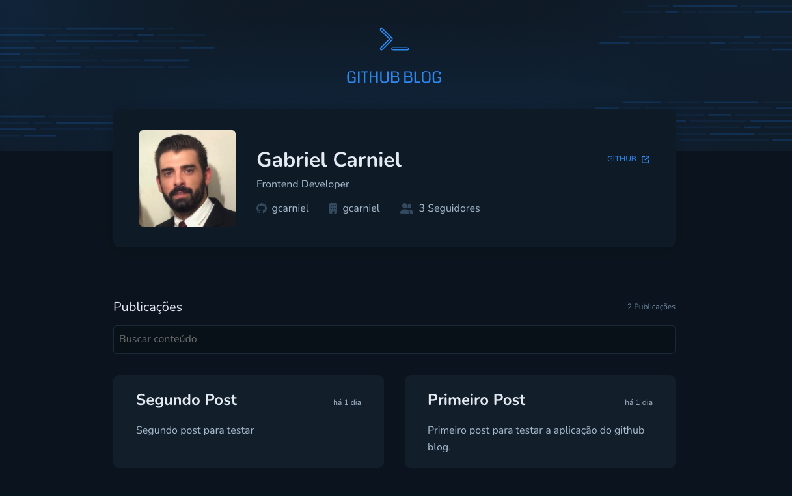

<h1 align="center"> GitHub Blog </h1>

<p align="center">
Este é mais um desafio proposto no curso IGNITE da Rocketseat. 
<br/>
Cada módulo é desenvolvido uma aplicação e após é proposto um desafio para testar os conhecimentos.
<br/>
</p>

<p align="center">
  <a href="#-tecnologias">Tecnologias</a>&nbsp;&nbsp;&nbsp;|&nbsp;&nbsp;&nbsp;
  <a href="#-projeto">Projeto</a>&nbsp;&nbsp;&nbsp;|&nbsp;&nbsp;&nbsp;
  <a href="#-layout">Layout</a>&nbsp;&nbsp;&nbsp;|&nbsp;&nbsp;&nbsp;
  <a href="#memo-licença">Licença</a>
</p>

<p align="center">
  
</p>

<br>

<p align="center">
  
</p>

## 🚀 Tecnologias

Esse projeto foi desenvolvido com as seguintes tecnologias:

- ReactJS
- React Router
- Styled Components
- Git e Github
- Figma
- Hook Form
- API do Github
- Axios
- Date-fns

## 💻 Projeto

GitHub Blog.

O github fornece uma rica API e o desafio era utilizar algumas API do github e construir um blog.
O blog consiste em buscar as issues de um determinado repositório, então é possível postar conteúdo em um repo e tornar isso um blog.

No arquivo Blog.tsx há duas constantes.
```js
const GITHUB_USER = 'gcarniel'
const GITHUB_REPO = 'ignite-03-desafio-github-blog'
```

Caso deseje usar o projeto ou até mesmo evoluí-lo, basta passar seu usuário do github e o repositório que será seu blog.


- [Visite o projeto online](https://ignite-03-desafio-github-blog.vercel.app/)

## 🔖 Layout

Você pode visualizar o layout do projeto através 
[DESSE LINK](https://www.figma.com/file/JWlwtTLF1UNCr11ntRq19u/GitHub-Blog-(Community)?node-id=0%3A1&t=ROazw0l5fzchUbQb-0). É necessário ter conta no [Figma](https://figma.com) para acessá-lo.

## :memo: Licença

Esse projeto está sob a licença MIT.

---
